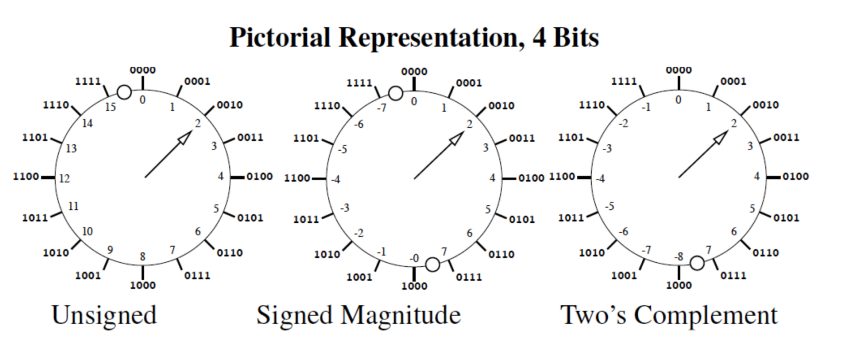

# Lecture 2: Data Representation and Manipulation

Recall from Lecture 1:
- Combinational and Sequential types of digital systems
- Coding and decoding of inputs into binaries and vice versa for easier system operation

How characters and numbers are represented in a computer
- ASCII (7 bits - 128 chars)

## Binary Representation:

$$ \displaystyle \sum_{i=0}^{n-1} x_i r^i $$

where we have $x_i$ in $\{0,1,\dots,r-1\}$ as the digit and $r$ the radix
- with binary we can represent values from $\[ 0 \leq x \leq r^n - 1 \]$ (for unsigned
  binary numbers)

Signed Binary Numbers:
- use the MSB (first bit from left to right) as a sign bit (where 0=positive and
  1=negative)
- In this case $1110$ represents $-6$. Now with 4 bits we can represent from $\[-7,7\]$
- We run into problems when trying to represent 0, since there will be two
  representations for signed v. unsigned
- Addition is also complicated in this implementation

## Two's Complement:
- Let the MSB represent the negative of a power of 2
- In this case, for $1110$ now represents $-2$. With 4 bits we represent from $\[-8,7\]$

Pictorial Representation in 4 Bits:

### Negating Two's Complement

For a bit pattern $x$, let $\overline{x}$ be the result of inverting each bit. 
- For $x=0110$, we have $\overline{x} = 1001$

In this case, $x+\overline{x}$ is always $1111$, which is $-1$. Then, we can say $-x =
\overline{x} + 1$.
- So for $x=0110$, we have $-x = 1010$

### Sign Extension

If we use 4 bits for a two's complement representation, we can easily scale to higher
bits
- With 4 bits, $0110$ is $6$, in an 8 bit representation this is just $0000 \enspace 0110$
- With 4 bits, $1010$ is $-6$, in an 8 bit representation this is just $1111 \enspace 1010$
- So in general, we just copy the old MSB into all the new positions

## Addition

To add two's complement numbers, we throw any carry out of the MSB position, and add
normally. 

For subtraction we negate and add.

Consideration: what if we can't represent the answer (overflow). Note that this cannot
occur if the numbers we are adding are opposite sign

Example: $1101 + 1111$
- Here we get $1100$ as our answer (-4), as expected.

Example: $0101 + 0011$
- Here we get $1000$ as our answer (-8), but we expect 8. Overflow has occured

## Switching Functions

We want to relate the input and output of a system using a switching function.
- This can be a tabular representation where we just assign inputs to a certain output

